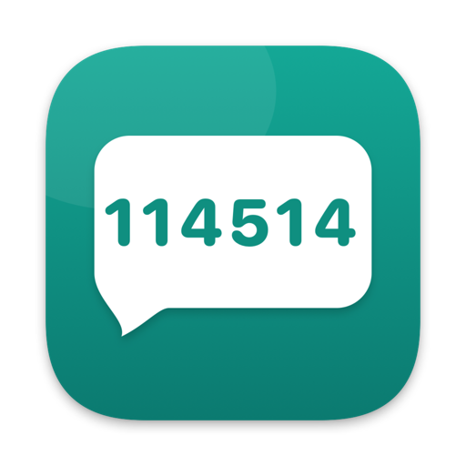
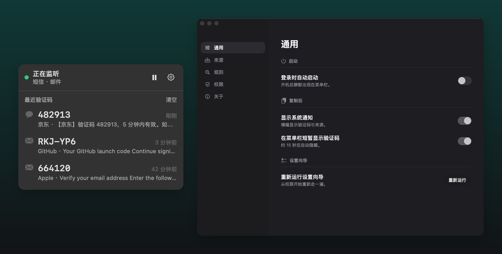
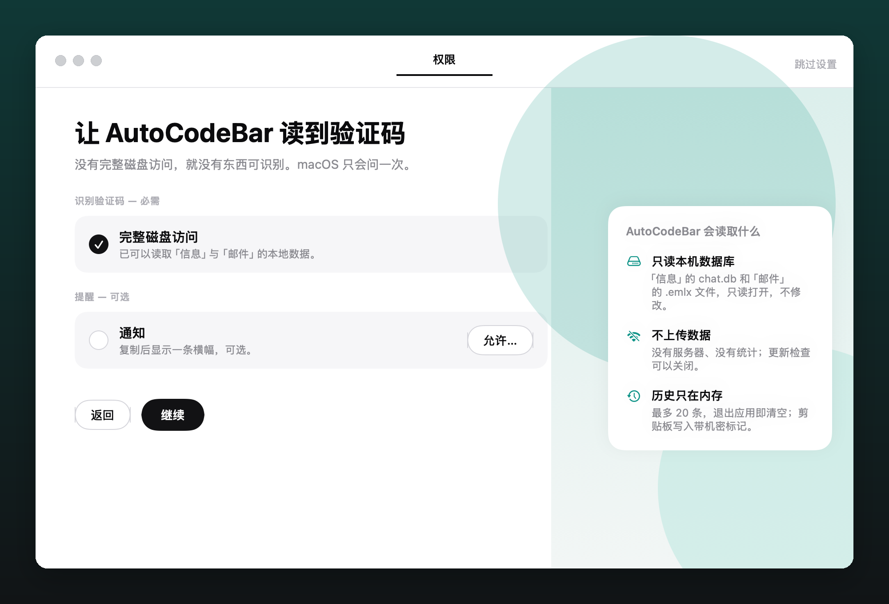

<div align="center">
  
  <h1>AutoCodeBar</h1>
  <p><strong>Verification codes from SMS and email, copied to your Mac's clipboard automatically.</strong></p>
  <p>A native, lightweight, fully offline macOS menu bar utility.</p>
  <p><a href="README.md">简体中文</a> · English</p>
  <p>
    <a href="https://github.com/qzz0518/AutoCodeBar/stargazers"></a>
    
    
    <a href="LICENSE"></a>
    <a href="https://x.com/zerah_eth"></a>
  </p>
</div>

<p align="center">
  
</p>

AutoCodeBar lives in the menu bar and watches Messages and Mail on this Mac for new content. When it
recognises a verification code it copies it to the clipboard immediately, shows the digits next to the menu
bar icon for about 15 seconds, and can optionally post a system notification. All you do is ⌘V. Recognition
happens entirely on your Mac: there is no server and no analytics; the only network access is the update
check, which you can turn off.

> [!IMPORTANT]
> AutoCodeBar reads the data files Messages and Mail keep on this Mac, so it needs Full Disk Access; the
> first-run guide walks you through granting it. It is an independent project, not affiliated with or
> endorsed by Apple. The Notification Center source is experimental: it depends on a private macOS database
> format that may change with a system update, and it is off by default.

## Features

- **Three independent sources**: SMS / iMessage reads the local Messages database; Mail watches for new
  `.emlx` files written by Apple Mail and handles plain text, HTML, quoted-printable, base64, and multiple
  character sets; Notification Center (experimental) reads the system notification database and can cover
  notifications delivered to the Mac by iPhone Mirroring and other apps. Each source has its own switch and
  its own live status.
- **No polling**: FSEvents drives every source. An SMS is usually on the clipboard within half a second of
  arriving.
- **Code in the menu bar**: after a copy, the digits appear next to the menu bar icon for about 15 seconds,
  so you can confirm the copy without a notification.
- **System notification**: optional. A banner reads "Copied code 482913 · from JD · SMS".
- **Recognition, not just matching**: a keyword gate first (Chinese, English, Japanese, Korean, Traditional
  Chinese, all customisable), then each candidate is scored on distance to the keyword, position after it,
  digit count, and context. Amounts, units, years, card tails, order numbers, and digits inside URLs are
  excluded. Formats like `G-482913`, `482-913`, and `RKJ-YP6` are normalised correctly. Thirty-nine
  realistic samples run as a regression suite.
- **Cross-source de-duplication**: the same SMS shows up in both Messages and Notification Center; a given
  code is copied once within five minutes.
- **Privacy built in**: history lives in memory only, at most 20 entries, cleared on quit. Clipboard writes
  carry the `org.nspasteboard.ConcealedType` marker, so clipboard managers that honour it will not store
  the code.
- **Guided permission**: Full Disk Access has no system prompt. AutoCodeBar opens the right System Settings
  pane and floats a card next to it. Drag the AutoCodeBar icon from the card into the list and the card
  dismisses itself once the grant takes effect.
- **Launch at login**, **native light and dark mode**, and a **live rule tester** (paste a message and see
  the result instantly, without touching the clipboard).
- **Secure updates**: Sparkle checks for and installs EdDSA-signed releases; the installer is Developer
  ID-signed and Apple-notarized.
- **Simplified Chinese and English**: the panel, settings, onboarding, and notifications follow the system
  language, and you can pick a language just for AutoCodeBar under System Settings › Language & Region.

## Quick Start

### Requirements

- macOS 14 or later (validated on macOS 15.7)
- Apple Silicon or Intel Mac; built locally with SwiftPM
- The SMS source needs Text Message Forwarding enabled from your iPhone to this Mac, or iMessage signed in
- The Mail source needs Apple Mail configured with an account that syncs mail to this Mac

### Homebrew

```bash
brew install --cask qzz0518/tap/autocodebar
```

To update later:

```bash
brew upgrade --cask autocodebar
```

### Install from DMG

Download the latest `AutoCodeBar-*.dmg` from [Releases](https://github.com/qzz0518/AutoCodeBar/releases),
open it, and drag AutoCodeBar into Applications. Sparkle inside the app checks for later updates.

Homebrew and Releases ship the same Developer ID-signed, Apple-notarized Universal 2 DMG.

### Build from Source

Requires Xcode 26 or the matching Command Line Tools (Swift 6.0+):

```bash
git clone https://github.com/qzz0518/AutoCodeBar.git
cd AutoCodeBar
./script/build_and_run.sh
```

The script builds in release configuration, assembles `dist/AutoCodeBar.app`, signs it with a stable
identity available on this Mac, and launches it. With [mise](https://mise.jdx.dev) installed, `mise run verify`
builds, tests, validates the localization and release metadata, and assembles the app in one go. To install into Applications:

```bash
./script/build_and_run.sh --install
```

If `/Applications` is not writable the app goes to `~/Applications`.

> [!NOTE]
> Run the `.app`, not `swift run`. A menu bar app needs a complete bundle, `LSUIElement`, and a stable code
> signature; without them the Full Disk Access grant cannot attach to the right subject.

### About signing

macOS ties the Full Disk Access grant to the app's code signing requirement. An ad-hoc signature's
requirement is a `cdhash` that changes on every build, which means re-granting after every rebuild. The
build script picks, in order, the `CODESIGN_IDENTITY` environment variable, a `Developer ID Application`
identity in the keychain, an `Apple Development` identity, and finally ad-hoc, printing a warning when only
ad-hoc is available. Any Apple development certificate is enough; notarisation is not required.

## First Run

1. After launch, a key icon appears in the menu bar and the onboarding window opens. If you run a menu bar manager such as Ice or Bartender, the new icon may land straight in its hidden section; drag it out from there.
2. On the Permissions step, click **Open System Settings**. System Settings jumps to Privacy & Security ›
   Full Disk Access and a card floats beside it. Drag **AutoCodeBar** from the card into the list and turn
   its switch on. The card notices the grant and dismisses itself.
3. If System Settings asks you to reopen the app, or the guide still shows "not granted" after ten seconds,
   click **Relaunch**.
4. Notifications are optional. Allow them for a banner on every copy; decline and the code still appears in
   the menu bar.
5. Click **Done**. Everything else lives under menu bar icon › gear › Settings.

**SMS on your iPhone**: the recommended path is iPhone Settings › Messages › Text Message Forwarding with
this Mac ticked; messages then land in the Messages app and AutoCodeBar uses the SMS source. If you use
iPhone Mirroring, iPhone notifications reach the Mac's Notification Center; enable the experimental
Notification Center source under Settings › Sources.

**Pause**: the pause button at the top right of the panel stops every source and the icon becomes an
outlined key. Relaunching the app resumes monitoring.

<p align="center">
  
</p>

## Verified Scope

| Capability | Status | Boundaries |
| --- | --- | --- |
| SMS / iMessage | Verified on hardware, macOS 15.7 | Inbound messages only (`is_from_me = 0`); body read from `text`, falling back to the typedstream in `attributedBody`; messages older than 10 minutes are ignored |
| Mail | Verified on hardware | Only `.emlx` files stored locally by Apple Mail; `.partial.emlx` skipped; `text/plain` preferred, HTML converted to text otherwise; mail older than 15 minutes ignored |
| Notification Center | Experimental | Reads the `group.com.apple.usernoted` database; parses `titl` / `subt` / `body`; Telegram and similar chat apps ignored by default; private format that may break after a system update |
| Code recognition | 39-sample regression suite | 4–8 alphanumeric characters with at least one digit; keyword gate before scoring; amounts, units, years, card tails, order numbers, and digits inside URLs excluded |
| De-duplication | Unit-tested | A code is accepted once per 300 seconds regardless of source |
| Clipboard | Verified on hardware | Replaces the current clipboard contents; carries the concealed marker |
| Auto-paste / auto-enter | Not provided | Would require Accessibility permission; out of scope |

## Privacy and Network Use

| Data | How AutoCodeBar handles it |
| --- | --- |
| SMS, mail, and notification content | Local data files opened read-only and parsed in memory; nothing is written anywhere |
| Code history | Memory only, at most 20 entries, cleared when the app quits |
| Clipboard | The code itself, with the `org.nspasteboard.ConcealedType` marker |
| Settings | Stored in local `UserDefaults` |
| Network | Only the Sparkle update check reaches the signed appcast on GitHub Pages and GitHub Releases (once a day, can be turned off in Settings); no server, analytics SDK, or other requests |
| Permissions | Full Disk Access (required, to read Messages and Mail data); Notifications (optional) |

The GitHub and X buttons inside the app only open the corresponding page in your default browser.

## Development

The project is a SwiftPM package with two targets: `AutoCodeBarCore` (pure logic, tested) and
`AutoCodeBar` (the SwiftUI / AppKit app). Common tasks live in [`mise.toml`](mise.toml):

| Command | Purpose |
| --- | --- |
| `mise run build` | Build every target |
| `mise run test` | Run the recognition corpus, MIME, typedstream, pipeline, and settings migration tests |
| `mise run i18n` | Validate the Simplified Chinese and English string tables |
| `mise run release-config` | Validate Sparkle and release metadata without touching secrets |
| `mise run bundle` | Assemble and sign a host-architecture `dist/AutoCodeBar.app` |
| `mise run bundle-universal` | Assemble and sign a Universal 2 app |
| `mise run release-dry-run` | Build a Developer ID-signed Universal 2 DMG without notarizing |
| `mise run release` | Build, sign, notarize, staple, and generate the signed appcast from a clean tag |
| `mise run verify` | Build, test, validate localizations and release metadata, and assemble the app |
| `./script/build_and_run.sh` | Development entry point without mise: assemble, sign, and launch |
| `./script/build_and_run.sh --install` | Install into Applications and launch |
| `./script/build_and_run.sh --logs` | Launch and follow the app log (subsystem `dev.qiuzezheng.AutoCodeBar`) |
| `./script/build_and_run.sh --debug` | Debug build launched under lldb |
| `./script/build_and_run.sh --verify` | Build, launch, and confirm the process stays alive |
| `swift script/make_icon_artwork.swift Resources/AppIcon.png` | Redraw the icon artwork programmatically |
| `swift script/make_icon.swift Resources/AppIcon.png Resources/AppIcon.icns Resources/Screenshots/app-icon-rounded.png` | Produce the `.icns` and the rounded README image from the artwork |
| `swift build && .build/debug/AutoCodeBar --snapshot-popover out.png` | Render the panel to a PNG with sample data (debug builds only; menu bar managers push the icon off-screen, so clicking it programmatically for a screenshot is unreliable) |

```text
Sources/
├── AutoCodeBarCore/
│   ├── Domain/        SourceKind, SourceStatus, Candidate, CodeEvent, AppSettings
│   ├── Extraction/    TextNormalizer → ExtractionRules → CodeExtractor (scored recognition)
│   ├── Pipeline/      CodePipeline, Deduplicator, Clipboard, History
│   ├── Sources/       the three monitors plus FSEventsWatcher, SQLite, TypedStreamText, Emlx/MIME parsing
│   └── Permissions/   PermissionProbe, SystemSettingsLinks, DarwinPaths
└── AutoCodeBar/
    ├── App/           AutoCodeBarApp, AppDelegate, AppState
    ├── MenuBar/       menu bar icon and panel
    ├── Settings/      the five settings pages
    ├── Onboarding/    first-run guide
    ├── Permissions/   Full Disk Access guide card
    ├── Support/       Sparkle updates, launch at login, notifications, relaunch
    └── Design/        Theme tokens and shared components
Resources/Localizations/  zh-Hans and en string tables
Tests/                 corpus, parser, pipeline, and migration tests
```

## Contributing

Issues and pull requests are welcome. When reporting a missed or wrong code, include the message text with
unrelated digits changed, the code you expected, the source type (SMS / Mail / Notification), and your macOS
version. Please do not upload real phone numbers, email addresses, or codes that are still valid.

- [Report an issue](https://github.com/qzz0518/AutoCodeBar/issues)
- [Browse the source](https://github.com/qzz0518/AutoCodeBar)
- [Follow @zerah_eth on X](https://x.com/zerah_eth)

## Acknowledgements

- [LeeeSe/MessAuto](https://github.com/LeeeSe/MessAuto) for the "keyword gate, nearest candidate" approach
  to recognition. AutoCodeBar's Swift implementation is written independently.

## License

The project's own code is released under the [MIT License](LICENSE). Apple, macOS, iMessage, and other
trademarks belong to their respective owners.
